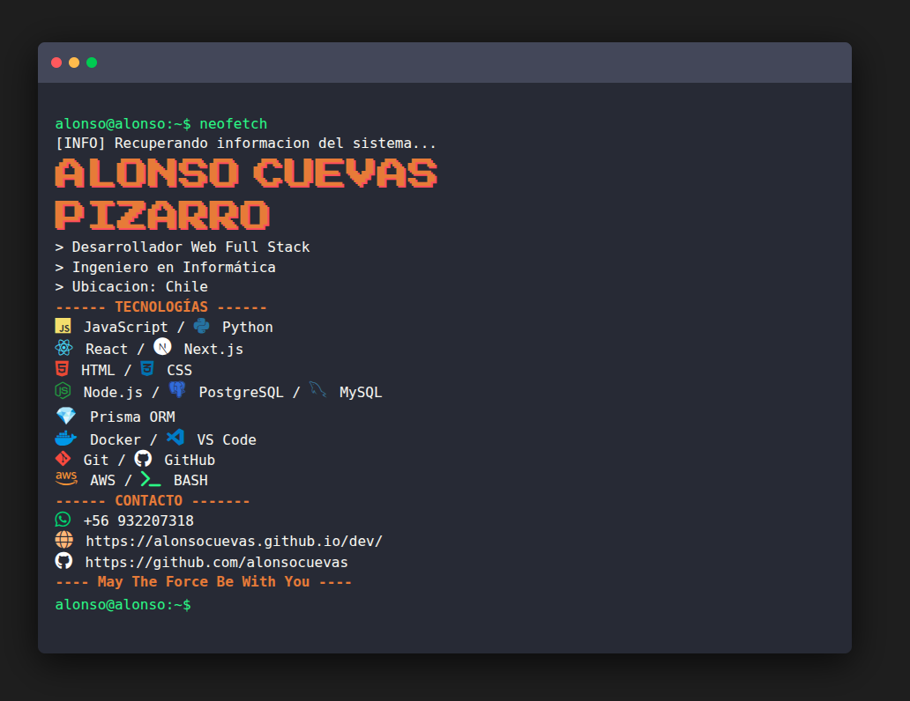

# 💻 Neofetch Web - Alonso Terminal

Simulación visual inspirada en el comando `neofetch` de Linux, desarrollada completamente en HTML, CSS y JavaScript.

El proyecto recrea una terminal interactiva con animación de escritura en tiempo real, mostrando información personalizada, tecnologías utilizadas y enlaces de contacto, todo con una estética retro enfocada en terminales Linux modernas.

Fue desarrollado como proyecto visual y experimental para representar parte de mi perfil profesional mediante una interfaz minimalista y temática.

---

# 📸 Vista Previa



La aplicación simula:

- Ejecución del comando `neofetch`
- Terminal Linux interactiva
- Animación de escritura tipo compilación
- Información profesional personalizada
- Tecnologías y herramientas utilizadas
- Diseño responsive estilo hacker/retro

---

# 🚀 Características

- Animación progresiva de escritura
- Cursor parpadeante dinámico
- Estética estilo terminal Linux
- Inspiración visual en Neofetch
- Diseño responsive
- Uso de iconografía Devicon y FontAwesome
- Tipografías pixel art
- Interfaz completamente frontend
- Sin dependencias backend

---

# 🛠️ Tecnologías Utilizadas

## Frontend

- HTML5
- CSS3
- JavaScript Vanilla

## Librerías y Recursos

- Font Awesome
- Devicon
- Google Fonts

---

# 🎨 Diseño Visual

El proyecto utiliza una combinación de estilos inspirados en:

- Terminales Linux
- Paleta Drácula / Monokai
- Pixel Art
- Interfaces retro
- Consolas CLI modernas

---

# 📂 Estructura del Proyecto

```bash
neofetch/
├── readme-img/
├── README.md
├── index.html
├── script.js
└── styles.css
```

---

# ⚙️ Funcionamiento

El sistema genera una simulación animada de terminal utilizando JavaScript.

Cada línea:

- Se renderiza dinámicamente
- Mantiene retrasos controlados
- Simula compilación/escritura
- Incluye iconografía y estilos personalizados

La información mostrada incluye:

- Nombre
- Cargo
- Tecnologías
- Herramientas
- Contacto
- Redes profesionales

---

# 🧠 Funcionalidades Técnicas

## ⌨️ Simulación de Escritura

El efecto principal se construye mediante:

- `async/await`
- `Promises`
- `requestAnimationFrame`
- Renderizado progresivo de caracteres

---

## 🖥️ Terminal Interactiva

Incluye:

- Cursor animado
- Auto-scroll
- Colores dinámicos
- Separadores visuales
- Estructura tipo shell Linux

---

## 📱 Responsive Design

Adaptado para:

- Desktop
- Tablets
- Dispositivos móviles

Con media queries optimizadas para mantener legibilidad y proporciones.

---

# 🎯 Objetivo del Proyecto

Este proyecto fue desarrollado únicamente como una representación visual y personalizada del comando `neofetch` adaptado con información profesional propia.

Su objetivo principal es:

- Practicar manipulación del DOM
- Crear interfaces visuales originales
- Simular comportamientos de terminal
- Experimentar con animaciones frontend

---

# 📦 Instalación y Uso

Clona el repositorio:

```bash
git clone https://github.com/alonsocuevas/neofetch.git
```

Ingresa al proyecto:

```bash
cd neofetch
```

Abre:

```bash
index.html
```

También puedes utilizar:

- Live Server (VSCode)

---

# 🔧 Dependencias

Este proyecto no utiliza:

- Node.js
- npm
- package.json
- frameworks
- backend
- base de datos
- variables de entorno

Todo funciona directamente desde archivos estáticos.

---

# 🌐 Compatibilidad

Compatible con navegadores modernos:

- Google Chrome
- Microsoft Edge
- Firefox
- Brave
- Opera

---

# 📄 Licencia

Proyecto desarrollado con fines personales, visuales y educativos.

Uso libre para inspiración y aprendizaje.

---

# 👨‍💻 Autor

## Alonso Cuevas Pizarro

Desarrollador Web Full Stack enfocado en:

- React
- Node.js
- PostgreSQL
- Docker
- Linux
- Desarrollo Web

---

# 🔗 Enlaces

## 🌍 Portafolio

```txt
https://alonsocuevas.github.io/dev/
```

## 💻 GitHub

```txt
https://github.com/alonsocuevas
```

---

# 🖼️ Concepto

> “May The Force Be With You”

Inspirado en:
- Linux
- Neofetch
- Cultura terminal
- Retro computing
- Interfaces CLI